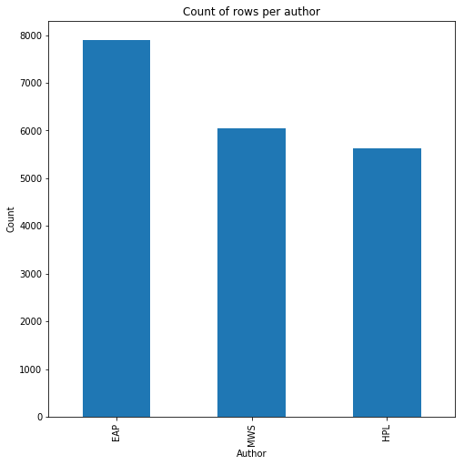
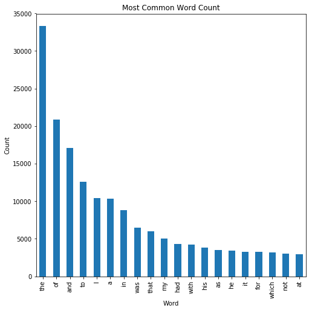
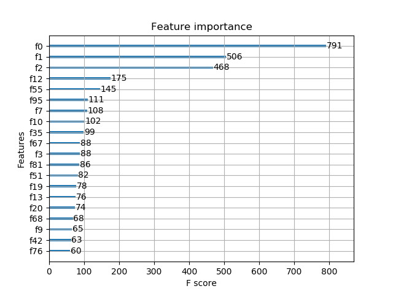
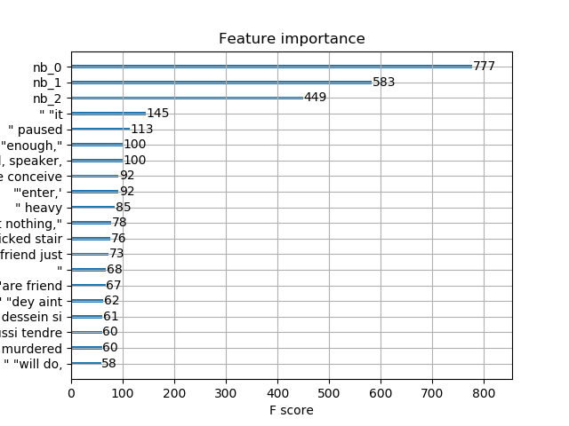
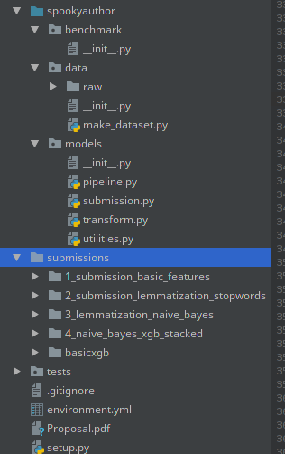

# Machine Learning Engineer Nanodegree
## Capstone Project - Spooky Author
Ravin Kumar
November 19th, 2017

## I. Definition
### Spooky Author Classification
Given a sentence is it possible to predict who wrote it? In one line that's the summarization of this project. Kaggle,
a data science platform, provided a corpus of text from three authors, HP Lovecraft, Edgar Allen Poe and
Mary Shelley, in two files, one with labels, and one without. Given this quote
"But a glance will show the fallacy of this idea.", the goal of the project is to correctly identify the author
that wrote it, in this case Edgar Allen Poe.

As well as provided the datasets Kaggle also provides a platform for sharing code and a leaderboard for rankings.
Although not required, after downloading the dataset and making predictions, the resultant predictions can be
uploaded back to Kaggle to see how they fare against others models.

### Problem Statement
The specific problem is "Given a string of words is it possible to classify the author of the text as Edgar Allen Poe,
Mary Shelley, or HP Lovecraft".

The problem will be split into approximately three chunks, Feature Engineering, Predictor Tuning, and Code Implementation

#### Feature Engineering
The dataset provided only comes with "base" feature column, which is a string of text. Fortunately the class of
problem is very well known, and is typically referred to as a Natural Language Processing problem. In this class
of problem, a raw string is translated into features using various transformations, such as Term Frequency Inverse
Document Frequency, Word Count Length, Word Stemmers etc.

#### Predictor Tuning
After features have been defined the next step is apply statistical predictors to the dataset. Numerous algorithms
exist but in particular the two that will be used here are Multinomial Gaussian Bayes and Xgboost. Both are models
that are known to work well in multiclass classification, and most importantly are able to provide class probability
which is necessary for th metric below.

#### Code Implementation
Often overlooked but a large part of machine learning problems is code implementation. While the steps may be
easy to discuss, in practice what ends up happening is "spaghetti code" ends up being the result a long running
machine learning project, and it becomes difficult for someone else to approach the codebase and continue working on it.

This occurs because unlike traditional programming, machine learning projects have a large iterative component to them.
The coder is typically trying things as they're going. What starts as a simple series of steps ends up getting convoluted
into a random assortment of predictions, data transformations, and matrix indexing, that at the end outputs
either a tabular dataset, or a picture.

Having being caught in that mess above numerous times, for me one large component of this project was to learn
how to structure a machine learning project so it is maintainable and so it would be more obvious to an outside
user what portion of the code does what function.
In this section, you will want to clearly define

### Metrics
Kaggle provides the metrics used to score predictions, in this case the metric chosen was the Log Loss metric. Log Loss
takes an array of probabilities, and essentially measures how separated the predictions for the classes are from
each other. Log Loss is a fairly common metric and used extensively in many areas, such as deep learning, as it
favors class separability, not just correct predictions.

Another softer metric I am using for this project though is "How maintainable is my code?". Again one of the objectives
I have for this project is to ensure I am continuing to write better libraries. While in a Kaggle competition
getting the top prize is all that's measured, in organizations it is necessary for the code to be maintainable for
a longer lifespan than just one prediction.

## II. Analysis

### Data Exploration and Visualizations
Taken from the project proposal, an example of the data is shown below.
**id26305, The surcingle hung in ribands from my body., EAP**
In this string the ID is labeled with id26305, and the author is labeled as Edgar Allen Poe.
In the string we can see some interesting words such as surgcingle and ribands.
The hops is by analyzing the writing styles, word usage, and phrasing, of thousands
of these strings we can id the authors without needing labels.
The dataset is roughly balanced with 7900 samples from Edgar Allen Poe,
6044 from Mary Shelley, and 5635 from HP Lovecraft.

When looking at the most common words it can be seen that they're not very distinctive words, or even spooky words.
Unfortunately they're words that we tend to see a lot, which unfortunately for the model won't help much with predictions.
They indicate that we'll have to do some of the feature engineering to make this more usable.
 Later one we'll see how we remove these using the stop words method included in sklearn.

### Algorithms and Techniques
#### Techniques
For text feature extraction I chose to use two types of techniques, "off the shelf" text processors
such as "Term Frequency Inverse Document Frequency", Word Stemmers, and hand built features,
such as word count, string length etc.

The off the shelf features are chosen from prior research on Natural Language Processing. For exa
In this section, you will need to discuss the algorithms and techniques you intend to use for solving the problem.
Many of these can be found in the aptly named "text" module of sklearn, which provides a series of tools for working
with textual data.

##### Term Frequency Inverse Document Frequency
Term Frequency Inverse Document Frequency is a method where each document is turned into a long vector, where each
column represents the number of times the term appears in that document, divided by the total words. Techniques like
these typically return what's called Sparse Matrices, as most of the columns have zero values. This technique was chosen
as it's easy to implement from sklearn and included as part of the package as it is commonly used in similar problems.

#### Word Stemmers
In natural language processing it is sometimes beneficial to unintuively made the text less readable. Take
for example the following sentences
* I like dogs
* I like a dog
* I like cats

To a human it is clear the first two sentences are more related than the third because they refer to dogs, but to a
computer the word dogs and dog are totally different. If the above string was passed into a TDIDF transformer
you would see that there would be one column generated for dog, and another for dogs. As is such another processing
step is used which is called word stemming. In this technique the strings would be preprocessed so that the word
"dogs" would be turned into the word "dog". Applying this technique helps computers determine relevant topics
more easily.

##### Hand Built Features
In addition to pre built algorithms, I also decided to hand build a couple of features, such as string length,
and word count. The reason for this was two fold. One is that these features would perhaps be predictive of author.
But more compelling to me was to learn how to build custom transformers using sklearns base Transformer classes.
As we will be discussed later, sklearn provides a number of well designed apis to handle data, such as the Transformer
Patten, and Predictor pattern, and these patterns are later abstracted using Pipelines and Feature Unions. As
part of this project I wanted to learn how to properly extend the sklearn package as I was hoping it would lead
to more maintainable code.

### Predictors
#### Naive Bayes
Naive Bayes family of algorithms are an easy to understand, easy to implement, classifier. In this particular
problem we will be using the MultiNominal Naive Bayes classifier as it can return probability of class
for all classes possible.

Naive Bayes Classifiers work by starting "naively" with an uninformed perspective of the world. During training
features are provided to the model, as well as the correct class label, and the model updates its prior distribution to
reflect the new information. For example in real life, if you went to a a restaurant for the first time
you would won't be sure whether it's good or not. The first time you eat there the dish might be really good, and
you'll update your opinion to "good!". The next time you eat there the dish might also be good, in which case
this reinforces your opinion on the establishment. Naive Bayes works similarly.

Naive Bayes models are user friendly as they have very few parameters, train efficiently, and have been shown
to have good performance in practice.

#### XGboost
XGBoost models are an implementation of boosted CART trees. In a quick summary the XGboost model is very popular
as they have been shown to have extremely good performance with classification tasks. Typically in Kaggle competitions
as well there are numerous tutorials that use XGboost models so to take advantage of other peoples experience,
it is helpful to use XGboost as well to compare to other folks performance.

### Benchmark
Two benchmarks were used were a dummy classifier, and a simple XGBoost pipeline with default parameters.

#### Dummy Classifier
The dummy classifier is quite simple. It just predicts the most prevalent class as the prediction for all classes.
In this case the author with the most samples in the train set was Edgar Allen Poe. When uploading this prediction
to the Kaggle leaderboard the results were disappointing. The logloss score of 19 was the second worst score on the
leader board. As is such this benchmark was fairly useless and frankly pretty embarassing to keep on the leaderboard.

#### Simple XGBoost Classifier
The next attempt was a simple XGboost classifier pipeline. In this pipeline the text was transformed with a default
TFIDF transformer and predictions were made through the a default XGboost model. This model performed much better,
around .84, but was still near the bottom 90% of the leaderboard.

The simple XGboost benchmark was subsequently chosen as the more realistic internal benchmark for performance for
own models. It is important to note that the Kaggle leaderboard position itself is a benchmark I used as well, although
it was taken with a grain of salt as some of the implementations on Kaggle, while impressively good, are also
impressively complex.

## III. Methodology

### Data Preprocessing
One benefit of Kaggle is that the majority of the data munging is completed
for you. As is such Kaggle provided tidy datasets of the inputs that contained
three columns, an ID column, the actual text, and the author label. For the
test dataset the tidy dataset was the exact same, except the labels were
not included.

As mentioned above though, strings of text are not meaningful to machine learning
algorithms. As is such a number of data transformation steps were performed.
Each is detailed below.

#### Column Splitting
The first step was to take the raw csv file and split it into three columns,
ID, Text, and Author if available. The IDs were not used in the model
but were required as part of the submission to Kaggle so it was important they
were retained.

#### Vectorization
Each text string was vectorized using either the Term Frequency Inverse Document
Frequency method. As explained above what this does is turn a corpus of text
into an Words X Samples matrix, where the height of the matrix is the number
of transformed samples, and the columns are the ratio of word count to word
frequency in that particular document. As will be discussed below
this was the first method used but after further testing it was found that
Count Vectorization yielded better performance. Count Vectorization is similar
except that instead of a ratio it simply just counts the number of words
in each document.

#### Lemmazation
Lemmazation is a process where similar words are transformed into a similar
root word, for example "Flowers" and "Flower" transform into "Flower". This
means in the vectorization the two words would end up being counting
in the same column, whereas if they weren't preprocessed they would be counted
as two distinct words.

#### Stop Words Removal
Stop Words are words in a language that are relatively meaningless for the
concept of the sentence. For example in this sentence, the words "the", for",
"this", don't add any meaningful value, they are just words we use to stay
compliant with english language structure. The words that do convey meaning
are "meaningful", "value", and "sentence". We want the predictive algorithm
to be able to discern the topic from the noise and by removing stop words
we help it hone into that structure.

#### Singular Vector Decomposition
Singular Vector Decomposition, in this context known as Latent Semantic Analysis,
was attempted as well. With both text processing method above the number of
columns generated is typically in the thousands to tens of thousands.
Singular Vector Decomposition is a method that reduces the number of columns
in a matrix to the ones that provide the least amount of redunancy. In
machine learning terms this is referred to as dimensionality reduction.
The idea is by giving the learning algorithm less features that provide
more information it will have an easier time predicting the underlying
patterns in the data. This technique posed some challenges as it was returning
negative values, which cannot be used by the Naive Bayes classifier, but it was
used in conjunction with the XGBoost solution.

### Implementation
The implementation of the project focused on two objectives. One objective
was scoring higher on the Kaggle Leaderboard, but the other was writing a
more maintainable code library. Each will be discussed individually.

#### Predictive Pipelines
##### TDIDF and XGboost
The first real attempt prediction was a simple TDIDF vectorizer with a
default XGBoost Classifier. This pipeline was very simple, the entire
model was literally two lines of python code. The model performed much better
than the DummyClassifier, improving the score from 19 to .84 on the leaderboard.

##### TDIDF, Lemmization, and XGboost
The next model included Lemmatization. As described above lemmatization is a method where words that are topically
similar are transformed to be represented as the same word. The difference between tokenization and lemmatization
is that lemmatization transforms the words into non english words. The implementation of lemmatization required some
customer feature building but it was not too difficult, as both the NLTK and sklearn libraries made the integration
fairly straightforward. In this step stop words were removed as well.
Another inclusion was handbuilt features. The two included were word count and string length. Through testing
I learned that removing or including these features did not affect my leadboard score very much.

Unfortunately this model fared worse than the previous model, only achieving .96 on the leaderboard.

##### TDIDF, Lemmatization, and Naive Bayes
An outcome of the previous model was learning how long it took to iterate through XGboost models. Although not strictly
timed, each trial took about 2 minutes to run. While that wasn't terribly long it also meant that iterating
on features was not as quick as I was hoping.

In an effort to speed up iteration I switched to using a Naive Bayes model. Using Naive Bayes I was able to quickly
iterate through many parameters. In this step I performed many experiments, such as changing the ngram length in
TDIDF, using SVD for dimensionality reduction, and switching TDIDF with a Word Count vectorizer in place of TDIDF.

In this step I also completed all my evaluation metrics, including the cross validation code block and a confusion matrix
visualization.

Creating these tools helped me with two insights. One was that the hand built features were not very helpful in predicting
the author. The other though was that meta learning that the faster I could iterate on features, the more quickly
I could start converging on things that worked.

The results of this stage were extremely good and I was able to achieve the best performance to date, reducing my
score to .49 on the public leaderboard.

##### TDIDF, Lemmatization, and Naive Bayes XGboost Stack
The last model I used Naive Bayes as a feature generator for an XGboost model. In this pipeline I used a CountVectorizer
first to transform the text, then passed that matrix to both a Naive Bayes Classifier and a SVD transformer for
feature reduction. The XGBoost model would then be given the output of the Naive Bayes classifier and the SVD
transformer and be trained on the union of those two features.

I specifically wanted to implement this model to learn how to implement model stacking using the sklearn pipe api.
While it eventually was doable it was not nearly as straightforward as I would have hoped. It required wrapping
the Naive Bayes predictor into a transformer class, which was thankfully supported by sklearn. However the
more challenging part was using the feature_importance chart in XGboost.

XGBoost provides a utility that lets users introspect into the model by seeing which features were most used for splits.
Due to implementation details with sklearns pipelines, the feature labels would only display as numbers
which would not be very human readable.  

To get human readable labels back, it again was doable but it required some hacks to get it to work.  

Unfortunately again the model was my highest ranking model, coming in with a leaderboard score over 1, but an important
outcome of this implementation was learning how far I could extend the sklearn API.

### Refinement
Numerous techniques and processes were used to refine the model.  The first was
developing two methods to measure the model performance locally. The code
for the model was implemented in such a way that made it very simple to use
sklearns built in cross validation and grid search methods. Each processing
step was implemented as either an sklearn transformer or and sklearn predictor.
By using pipelines and feature unions, skearn provided the meta level programming
blocks that made calling predict or transform on a pipeline method call
both the custom and off the shelf code in the SpookyAuthorLibrary.
With cross validation it became trivially easy to perform 5 fold validations
to get an average score on unseen data.

Another technique was the use of confusion matricies, specifically a matplotlib
rendering that made it very easy to see what the true positives and false positives
were predicted for each class. In this method it became easy for me to see
where the model was misclassifying rows, such as predicting Edgar Allen Poe,
when instead the label should have been HP Lovecraft.

The last method was the Kaggle Leaderboard itself. By submitting the test set
to the leaderboard I got a true score of how the model performs against unseen data.

The actual process of refinement was largely detailed above, but it consisted
of setting a baseline, evaluating why a model was predicting poorly, then
trying a couple of experiements to see if the results matched my intuition.
I must give a lot of credit to the Kaggle forums. I utilized those heavily to
get ideas and see what others have tried and done.

## IV. Results

### Model Evaluation and Validation
The best model was the Naive Bayes implementation with just Count Vectorizer for two reasons. For one it performed the
best on the Kaggle leaderboard. However the softer code maintainability metric, it is a much simpler implementation.
The entire pipeline consisted of off the shelf sklearn modules with extra methods used for loading the data, making
predictions, and evaluating the performance through cross validation and confusion matrices.

In constrast the XGBoost implementation required the installation of custom packages that were compiled from github, as
a minimum. In the stacked model implementation, the Naive Bayes classifier had to be wrapped into a transformer
wrapper, the pipeline for feature transformation became more complex, requiring another custom passthrough transformer
to be coded, and model evaluation required deeper more custom code and some Python attribute hacking.

In terms of time and results the Naive Bayes implementation was the best combination for time and efficiency.

### Justification
Fortunately the final solution was better than the initial baseline, but unfortunately
there are many submissions that perform better than it. Without knowledge of
what others have done, I presume that many of them implemented techniques
such as deep neural nets and model ensembling. While these techniques perform
very well, with the hardware limitations I had it would have been
difficult to replicate the results in a reasonable amount of time.

## V. Conclusion

### Free-Form Visualization

Although not a data visualization the most important outcome for me was learning the ins and outs of creating
a reproducible data science package that can be easily shared, installed, validated, and built upon. In my chosen
structure the code that is reusable is part of the package. Each submission is in it's own directory, along with
a readme, an output file, and the code used to generate it. This structure has made it easy to iterate on this
project, without having to spend a lot of time trying to remember what I did in the past. In the future I'll be
using a similar template when at attempting any machine learning project.  

{height=400px}  
  
### Reflection
Kaggle competitions are rewarding in some ways, but challenging in others.
For example it's nice to be able to just download a tidy dataset, and start working
on predictions. However it becomes frustrating when you see that many others
are able to make models that are much more predictive than yours. For me
this is the difficulty with Kaggle, because it is competitive it requires
large amount of dedication and time to get to the top. In some ways as well
it's an unrealistic proxy for real life as the datasets and problems are predefined
whereas in most companies solving those two problems are just as challenging
as any of the math or coding.

In the purely mathematical side I found it interesting to tweak the models
and check the performance, notice how some features such as the hand built ones
were not as predictive as I had hoped. It was also interesting noting how much
the Naive Bayes models overfit the training dataset, and how cross validation
was a pretty good estimator of final performance.

From the implementation standpoint I really struggled with balancing
"fast and loose scripting" with building a library. Building a library
took more thought up front, and was also constraining, but when I got
it right it made iterating on models much more quickly.

My biggest takeaway however was the use of unittesting in machine learning code.
Using uniitests help me really understand how techniques were performing,
as well as debug machine learning pipelines, in reusable and clear ways.
In the future I'll continue using this technique to ensure that my hypothesis
about how the code functions matches the actual functionality.

### Improvement
Certainly the model can be improved, especially as proved by the Kaggle leaderboard.
Further efforts on this project could increase the use of ensembling to measure
the increase in performance. Additionally more advanced techniques such
as Deep Learning could be utilized to see if more information could be
extracted from the given dataset.

### References
https://nlp.stanford.edu/IR-book/html/htmledition/stemming-and-lemmatization-1.html
Code snippets and help used from sklearn website
Various Kaggle help forums and kernels